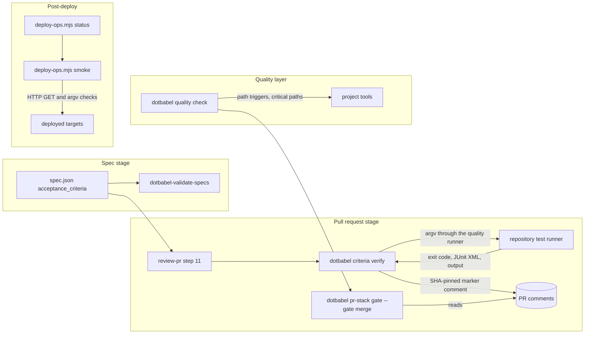

# §3 — High-Level Architecture

> System view: components, data stores, external dependencies, deployment.

## System Overview

The harness adds one question to every stage that dotbabel already governs: did the promised behavior run, and where is the proof? It adds no service. It extends five existing layers and adds one command family, `dotbabel criteria`.

| Layer            | Existing base                                                                 | What this spec adds                                                                                                                                                    |
| ---------------- | ----------------------------------------------------------------------------- | ---------------------------------------------------------------------------------------------------------------------------------------------------------------------- |
| Spec             | `spec.json`, `dotbabel-validate-specs`, the `spec` and `validate-spec` skills | Optional acceptance criteria with per-test confirmation (KD-1, KD-3)                                                                                                   |
| Pull request     | `review-pr`, `pr-conductor`, `pr-gates.mjs`, `dotbabel pr-stack`              | `dotbabel criteria verify`, a trusted evidence comment (KD-2), criteria reason codes, advisory test-quality judgment (KD-4), enforcement settings (KD-14)              |
| Quality          | `dotbabel quality`, language adapters, report parsers                         | Path-triggered tools and the `regression` capability (KD-5), active `critical_paths` (KD-6), mutation detection (KD-7), Python and Node test and coverage plans (KD-8) |
| Consumer surface | `dotbabel init` templates, `check-on-stop.sh`, `dotbabel doctor`              | CI workflow templates (KD-10), a pre-push hook (KD-11), related tests at turn end (KD-12), warnings for removed keys (KD-9)                                            |
| Post-deploy      | `deploy-status`, `release-conductor verify`, `rollback-prod`                  | Smoke checks and the `smoke-test` skill (KD-13)                                                                                                                        |

### Architecture Constraints

- **ARCH-1**: dotbabel stays a CLI and skill toolkit. This spec adds no service, daemon, or database.
- **ARCH-2**: Every command that the npm package executes for the harness runs through the quality runner (`plugins/dotbabel/src/quality/runner.mjs:22-94`), so trust, `shell: false`, the environment allowlist, output caps, timeouts, and redaction apply the same way everywhere. The deploy helper is the one exception: scaffolded copies of it cannot import package source (the run-direct guard comment in `skills/deploy-status/scripts/deploy-ops.mjs`), so it carries equivalent guards of its own (KD-13).
- **ARCH-3**: Gate logic stays pure. All `gh` and `git` calls stay in the bins (`plugins/dotbabel/bin/dotbabel-pr-stack.mjs:10`), and `pr-gates.mjs` receives plain data.
- **ARCH-4**: `CONDUCTOR_PHASES` keeps its six phases (Q-3, `plugins/dotbabel/src/pr-gates.mjs:43`).
- **ARCH-5**: dotbabel never installs a test, coverage, or mutation tool (`docs/quality.md:5`, Q-4).

## Data Stores

| Store                                          | Role                                                                      | Access Pattern                                                                                              |
| ---------------------------------------------- | ------------------------------------------------------------------------- | ----------------------------------------------------------------------------------------------------------- |
| `docs/specs/<id>/spec.json`                    | Acceptance criteria and acceptance commands                               | Written by people and the `spec` skill. Read by the validator, `dotbabel criteria`, and `dotbabel pr-stack` |
| `.dotbabel.json`, `quality` key                | Tool `paths`, `critical_paths`, mutation tools                            | Read on every quality run                                                                                   |
| `.dotbabel.json`, `criteria` key               | Enforcement mode, trusted associations, default timeout                   | Read by `dotbabel criteria` and the merge gate                                                              |
| Pull request comments on GitHub                | The single evidence comment for each pull request                         | Created or edited by `dotbabel criteria verify --post`. Read by the merge gate                              |
| Pull request body on GitHub                    | `## Spec ID`, `## Test plan`, and the test-plan deferral marker           | Read by the merge gate and by `dotbabel criteria verify --pr`                                               |
| `.claude/deploy-targets.json`                  | Deploy targets and their smoke checks                                     | Read by `deploy-ops.mjs status` and `smoke`                                                                 |
| User-scope trust allowlist                     | Trusted repository paths (`plugins/dotbabel/src/trust-allowlist.mjs:216`) | Read before any project command runs                                                                        |
| `.dotbabel/` in the repository, ignored by Git | JUnit reports and evidence JSON from local runs                           | Written on each run and never committed                                                                     |
| CI artifacts                                   | Quality and criteria JSON reports from the workflow templates             | Written by CI and read by reviewers                                                                         |

## External APIs / Dependencies

| Service                                     | Purpose                                                       | Rate Limits / Constraints                                                                                    |
| ------------------------------------------- | ------------------------------------------------------------- | ------------------------------------------------------------------------------------------------------------ |
| GitHub REST API through `gh`                | Read pull requests, and list, create, and edit issue comments | 5,000 requests per hour for each authenticated user. A comment body holds at most 65,536 characters (DOC-18) |
| Test runners owned by the repository        | Run criterion tests                                           | Must print test names or write JUnit XML (DOC-15)                                                            |
| Coverage tools declared by the repository   | Coverage reports for quality plans                            | Detected, never installed (ARCH-5)                                                                           |
| Mutation tools configured by the repository | Mutation reports in the `deep` profile                        | Detected, never installed. They run in `deep` only (`docs/quality.md:199`)                                   |
| Deployed targets                            | Smoke checks after a deploy                                   | Only HTTP GET checks retry, and each check and each run has a time limit (PERF-6)                            |
| npm registry                                | Distribution and `release-conductor verify`                   | Unchanged                                                                                                    |

## Deployment

- The harness ships in the `@dotbabel/dotbabel` npm package. `package.json` already ships `schemas/`, `skills/`, `plugins/dotbabel/bin/`, `plugins/dotbabel/src/`, and `plugins/dotbabel/templates/`.
- It runs in three places: an agent session in Claude Code, Codex, Gemini, or Copilot through the synced skills; a developer shell; and CI through the workflow templates.
- Skills reach consumers through `dotbabel init`, `bootstrap`, and `project-sync`. Templates regenerate with `npm run build-plugin`.
- Each phase in §6.1 releases as a semver minor version (§6.5, DOC-21).
